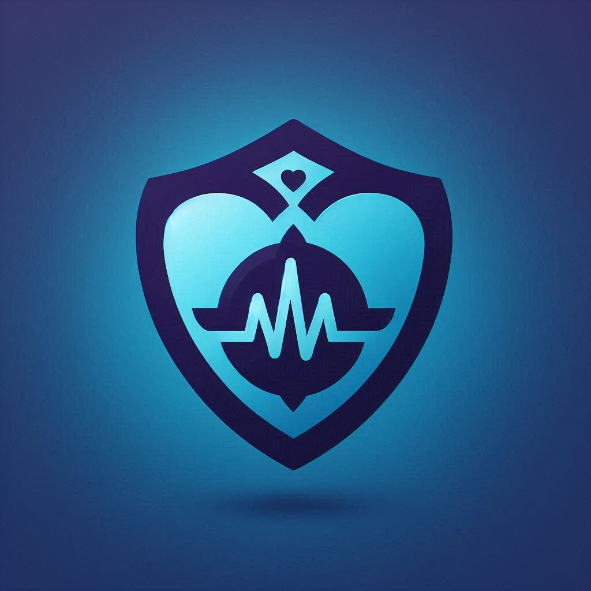

## VitalGuard: Real-Time Health Monitoring Platform
**Empowering healthcare providers with AI-driven real-time patient monitoring**

---

## Table of Contents
1. [Project Overview](#project-overview)
2. [Inspiration](#inspiration)
3. [Features](#features)
4. [Architecture](#architecture)
5. [Technologies Used](#technologies-used)
6. [Installation Guide](#installation-guide)
7. [How to Use](#how-to-use)
8. [Challenges Faced](#challenges-faced)
9. [Future Enhancements](#future-enhancements)
10. [Contributors](#contributors)
11. [License](#license)

---

## Project Overview
**VitalGuard** is an AI-powered platform designed for real-time patient health monitoring using **IoT devices** and **Azure cloud services**. It enables healthcare professionals to track patient vitals, detect anomalies, and respond swiftly to potential health risks. The solution combines **Microsoft Fabric**, **Azure IoT Hub**, **Azure SQL Database**, and **Azure OpenAI** to provide a seamless experience for proactive healthcare management.

---

## Inspiration
_The inspiration for VitalGuard came from the challenges faced by healthcare facilities during the COVID-19 pandemic, where there was a dire need for real-time patient monitoring solutions. Our goal was to create a robust system that not only monitors but also predicts potential health issues using AI._

---

## Features
- **Real-Time Data Streaming**: Captures patient vitals from IoT sensors and streams the data in real-time.
- **AI-Powered Anomaly Detection**: Utilizes Azure OpenAI to identify abnormal patterns in health metrics.
- **Interactive Dashboard**: Provides a user-friendly interface for monitoring patient health.
- **Alerts & Notifications**: Sends instant alerts to healthcare providers for timely intervention.
- **Historical Data Analysis**: Uses Azure SQL Database to store patient history for long-term analysis.

---

## Architecture
**System Architecture Overview**:

## Technologies Used
- **Microsoft Fabric**
- **Azure IoT Hub**
- **Azure SQL Database**
- **Azure OpenAI Services**
- **React** (Frontend Dashboard)
- **Power BI** (Data Visualization)
- **Node.js** (Backend APIs)
-
Installation Guide
1.	Clone the Repository:
~~~
git clone https://github.com/your-username/vitalguard.git
cd vitalguard
~~~
2.	Set Up Azure Resources:
- Create an Azure IoT Hub and register your IoT devices.
- Set up an Azure SQL Database.
- Deploy the Azure OpenAI model for anomaly detection.

## How to Use
1.	Connect IoT Devices: Use IoT sensors to capture patient vitals and send data to Azure IoT Hub.
2.	Monitor in Real-Time: Use the VitalGuard dashboard to monitor patient health metrics.
3.	View AI Insights: Analyze AI-generated alerts and historical data trends.
4.	Generate Reports: Use integrated Power BI for advanced reporting.
## Challenges Faced
- Data Integration: Integrating real-time IoT data with AI models required fine-tuning.
- Latency Issues: Optimizing data streams to reduce latency for real-time monitoring.
- Azure Services Learning Curve: Understanding Microsoft Fabric and Azure services was initially challenging.
## Future Enhancements
- Mobile App Support: Extend the platform to support mobile devices for remote monitoring.
- Expanded AI Capabilities: Implement more advanced AI models for predictive healthcare analytics.
- Multi-Language Support: Add support for multiple languages to cater to a global audience.
### Contributors
- Abdelrazek Rizk

License
This project is licensed under the GNU GENERAL PUBLIC LICENSE - see the LICENSE file for details.
